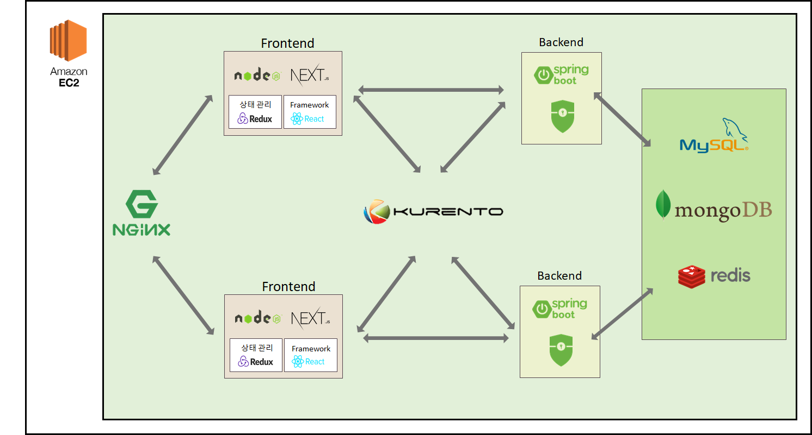
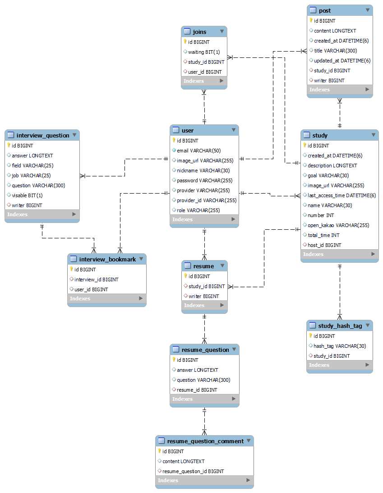
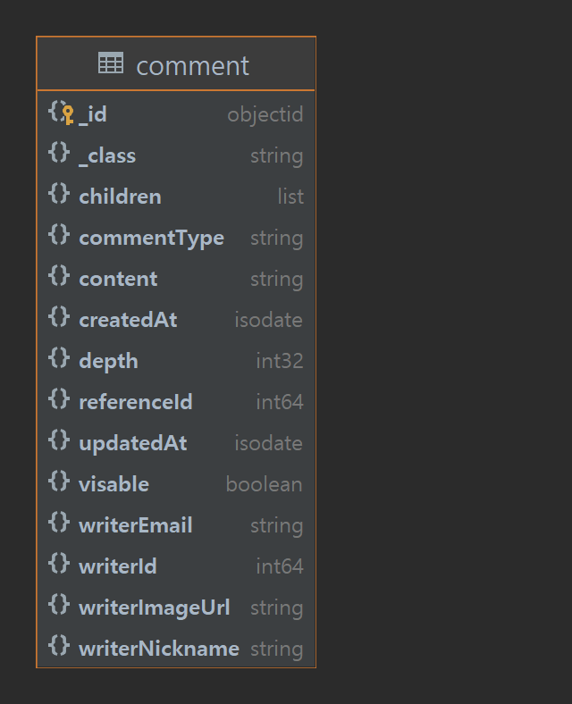

# 당당! (DangDang)
#### 당당하게 면접보자! 면접 연습을 도와주는 면접 스터디 플랫폼

개발기간:  22.01.10~22.02.18 (총 6주)<br/>

🏆 삼성 청년 SW아카데미 6기 공통PJT 최우수상

## 개발 배경
면접을 준비하기 위해서는 크게 첫 번째, 혼자 준비하는 것과 두 번째, 면접 스터디를 통한 준비가 있습니다. <br>
이 두가지를 통해 면접을 준비하기 위해서는 어떤 질문이 나올지 일일히 질문을 수집해야 하며, 질문에 답하는 모습을 녹화하기 위해 녹화 버튼을 매번 눌러야하고 스터디를 가입하기 위해 정보를 찾아봐야 하는 등의 귀찮음과 어려움이 있습니다.
<br>
그래서 저희는 이러한 문제점을 보완하고 실제 면접과 유사한 환경에서 면접 연습을 할 수 있도록 도와주는 면접 스터디 플랫폼 '당당'을 개발하였습니다. 

## **팀원 소개 및 역할**
<table>
    <tr>
      <td align="center">
        <a href="https://github.com/HyeIn-Kim">
          
        </a>
      </td>
      <td align="center">
        <a href="https://github.com/DongYu-Kim">
          
        </a>
      </td>
      <td align="center">
        <a href="https://github.com/cjscoding">
          
        </a>
      </td>
      <td align="center">
        <a href="https://github.com/AntCode97">
          
        </a>
      </td>
      <td align="center">
        <a href="https://github.com/Hyuk9606">
          
        </a>
      </td>
      <td align="center">
        <a href="https://github.com/dmswl0311">
          
        </a>
      </td>
    </tr>
    <tr>
      <td align="center">
          팀장 / FE<br />
        <a href="https://github.com/HyeIn-Kim">
          김혜인<br />
        </a>
      </td>
      <td align="center">
           FE<br />
        <a href="https://github.com/DongYu-Kim">
          김동유<br />
        </a>
      </td>
      <td align="center">
           FE<br />
        <a href="https://github.com/cjscoding">
          최지수<br />
        </a>
      </td>
      <td align="center">
           BE<br />
        <a href="https://github.com/AntCode97">
          이윤준<br />
        </a>
      </td>
      <td align="center">
          BE<br />
        <a href="https://github.com/Hyuk9606">
          임혁<br />
        </a>
      </td>
      <td align="center">
          BE<br />
        <a href="https://github.com/dmswl0311">
          조은지<br />
        </a>
      </td>
    </tr>
  </table>
<details>
    <summary>자세히</summary>
    
    - 김혜인(팀장, FE)
        - Frontend - Next.js, Redux, Sass(Scss)
    - 김동유(FE)
        - Frontend - NEXTjs, Redux
        - WebRTC - kurento
    - 최지수(FE)
        - Frontend - Next.js, Redux, Sass(Scss)
    - 이윤준(BE)
        - Spring - Spring boot, Spring Security, JPA, QueryDSL
        - DB - Mysql, MogoDB, Redis
        - CI/CD - Jenkins, Nginx,
    - 임혁(BE)
        - WebRTC - Kurento
    - 조은지(BE)
        - Frontend - Sass(Scss)
        - WebRTC - Kurento
</details>

## 기술 스택
### FE
       <br/>
    - WebRTC

### BE
      <br/>
    - WebrRTC, JPA, QueryDSL, Spring Data, Spring Security
### CI/CD
    

### Editor
  	

### 협업 툴
  <br/>
    - Mattermost, Gather Town

## 서비스 설명 및 주요 기능


- 와이어프레임 ([링크](https://www.figma.com/file/uYN0Te96uSVsloWIQJShqm/%EB%B3%B4%EB%A6%AC-%EC%99%80%EC%9D%B4%EC%96%B4-%ED%94%84%EB%A0%88%EC%9E%84?node-id=0%3A1))
<!-- ## 사용자 메뉴얼 -->
<!--  -->

### 1. 소셜 로그인

<details>
<summary> <h3>2. 혼자 연습한당 (1인 면접 연습)</h3></summary>
<div markdown="1">
    
    
- 1인 면접 연습 방 생성
- 나만의 질문리스트 생성 가능
- 카메라, 마이크 사전 테스트
- 면접 질문을 확인하고, 듣기 기능 구현 (TTS)
- 답변 타이머 구현
- 면접관 얼굴 추가 (가상 인물 영상)
- 답변 녹화 기능 구현
- 사운드 조절 기능 구현
- 질문별 녹화, 다운로드 기능


</div>
</details>
<details>
<summary> <h3>3. 같이 연습한당 (면접 스터디)</h3></summary>
<div markdown="1">
    
    
- 카메라, 마이크 사전 테스트
- 채팅, 화면 공유
- 카메라, 마이크, 스피커 장치 변경, on/off 기능
- 일반모드 UI
    - Zoom, Webex와 같은 화상채팅 모드
- 면접 모드 UI
    - 면접스터디에 최적화 된 UI
        - 면접관에게는 채팅, 지원자 자소서, 면접 모드 경과시간을 보여줌
        - 각각의 역할에 따라 카메라 배치에 차이를 둠
        - 자신의 영상은 오른쪽 하단 구석에 배치되며, 클릭시 PIP모드 작동


</div>
</details>
<details>
<summary> <h3>4. 질문 궁금하당</h3></summary>
<div markdown="1">
    
    
- 질문 게시판 카테고리 별 페이지 개발 &
    - 유저는 자신의 직군 또는 공통 면접 질문들을 보길 원한다
- 질문 게시판 검색 필터 컴포넌트 및 기능 개발 &
    - 유저는 원하는 주제에 관련된 질문들만 모아서 보길 원한다
- 질문 CRUD 페이지 개발 & 질문 CRUD API 개발
    - 유저는 질문을 등록하기를 원한다.
    - 유저는 질문을 수정하길 원한다.
    - 유저는 질문을 삭제하길 원한다.
</div>
</details>
<details>
<summary> <h3>5. 스터디 구한당</h3></summary>
<div markdown="1">
    
    
- 스터디 생성 가능
- 본인이 만든 스터디 정보 수정 가능
- 모든 스터디 최근 생성일 순으로 조회 가능
- 스터디 가입 신청 또는 가입 신청 취소 할 수 있음
- 스터디 검색어(해쉬태그)로 검색 가능
- 스터디 공고 상세 페이지 개발 → 스터디 상세 정보를 열람할 수 있고 스터디장과 댓글과 대댓글로 정보 공유 또는 질의응답 할 수 있도록 함
</div>
</details>
<details>
<summary> <h3>6. 팀 스페이스</h3></summary>
<div markdown="1">
    
    
- 팀정보 - (all)
    - 현재 스터디 현황을 알 수 있음 (개설일, 스터디원, 스터디장)
    - 스터디를 탈퇴할 수 있다.
- 팀정보 - (스터디장)
    - 스터디 가입 대기자의 가입 허용 및 기존 멤버를 강제 탈퇴시킬 수 있다.
    - 팀 정보 수정이 가능하다
    - 스터디를 삭제할 수 있다.
- 팀자소서
    - 팀원간의 자소서를 공유할 수 있고 각 질문별로 댓글로 피드백과 예상 질문을 공유할 수 있음(유저의 자소서는 각 스터디 별로 관리)
    - 본인이 작성한 자소서, 댓글 또는 대댓글일 경우 수정 삭제가 가능하다
- 팀보드
    - 공유 게시판으로 팀원 간 회사 정보 등을 공유할 수 있다.
    - 유저 본인이 쓴 글에 대해 수정, 삭제가 가능하다.


</div>
</details>
<details>
<summary> <h3>7. 마이페이지</h3></summary>
<div markdown="1">
    
    

- 유저 본인의 정보를 조회, 수정 할 수 있다.
- 당당을 탈퇴할 수 있다.
- 마이룸
    - 유저가 속한 스터디룸만 최근 생성일 순으로 조회 가능하다(각 스터디는 팀스페이스와 연결)


</div>
</details>
<details>
<summary> <h3>8. 관리자페이지</h3></summary>
<div markdown="1">
    
    

- 관리자는 당당의 모든 유저를 조회 가능하다
- 관리자는 유저를 매니저로 등업시킬 수 있다.
- 관리자, 매니저는 당당의 모든 질문을 조회 가능하다.
- 관리자, 매니저는 모든 질문에 대하여 공개, 비공개 설정이 가능하다.


</div>
</details>

## 사용법

#### Quick Start

Linux 

```bash
docker-compose -f ./docker-compose-all.yaml --build
```

Windows

```bash
docker-compose -f ./docker-compose-window.yaml --build
```

### FrontEnd

프론트엔드 폴더로 이동 후

```bash
cd ./frontend
```

라이브러리들을 설치 후

```bash
npm i
```

실행

```bash
npm run dev

or
// NEXTjs를 사용하여, 빌드 시 SSR가 된 모습을 볼 수 있음
npm run build
npm start
```

### Backend

Kurento Media Server를 실행

```bash
docker run --rm -p 8888:8888/tcp -p 5000-5050:5000-5050/udp -e KMS_MIN_PORT=5000 -e KMS_MAX_PORT=5050 --mount type=bind,source=C:/home/ssafy/share/videos,target=/tmp kurento/kurento-media-server:latest
```

백엔드 폴더로 이동 후

```bash
cd ./backend/dangdang
```

Jar 파일로 Build 후

```bash
.\gradlew bootJar
```

실행 ( 프로파일 설정과 KMS 서버 URL을 파라미터로 줌)

```bash
java -Dspring.profiles.active=dev -Dkms.url=ws://localhost:8888/kurento -jar .\build\libs\dangdang-0.0.1-SNAPSHOT.jar
```

## 기술 특장점

JPA  : BatchSize를 이용한 쿼리 최적화 적용

QueryDsl : 동적 쿼리를 위해 사용

MongoDB  : 답글 기능을 구현하기 위해 사용, 댓글 엔티티가 스스로를 참조하게 하여서 연관관계가 깊어질 수 있기 때문에, NoSQL 사용

KMS(Kurento Media Server) : N:N 스트리밍 구현을 위해 MCU & SFU 방식인 KMS 이용

## 컨벤션

### 코딩

- 백엔드: 카멜 케이스
- 프론트엔드: 카멜 케이스

### Git

```
feat : 새로운 기능에 대한 커밋
fix : 버그 수정에 대한 커밋
build : 빌드 관련 파일 수정에 대한 커밋
chore : 그 외 자잘한 수정에 대한 커밋
ci : CI 관련 설정 수정에 대한 커밋
docs : 문서 수정에 대한 커밋
style : 코드 스타일 혹은 포맷 등에 관한 커밋
refactor : 코드 리팩토링에 대한 커밋
test : 테스트 코드 수정에 대한 커밋
```

```bash
git commit -m “[Jira 이슈 번호] 접두어: 커밋메시지”
# 예시
git commit -m "[S06P12C203-85] chore: Jira 연동 테스트"
```

## 아키텍처 및 ERD







